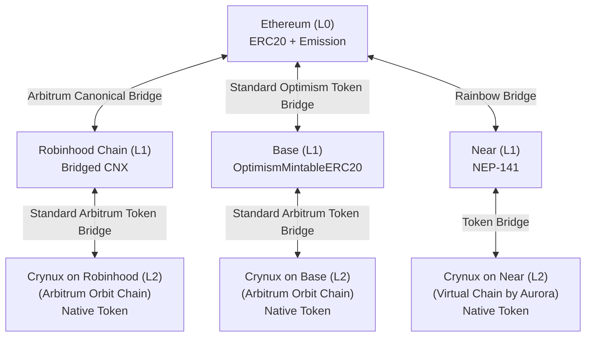
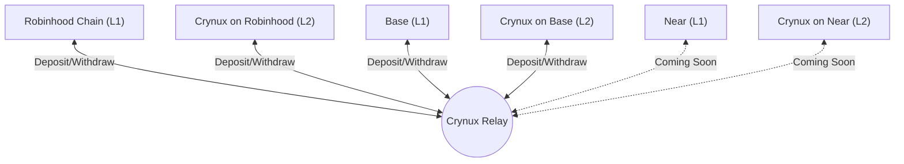

# Multi-chain Architecture

The Crynux Network is built on a multi-chain architecture, operating across multiple EVM-compatible blockchains. It currently supports Robinhood, Base, and Near, with future plans to expand the ecosystem to more blockchains.

The architecture has three layers:

* **L0 — Ethereum**: the canonical CNX ERC20 token lives on Ethereum, together with the Emission contract that releases new CNX according to the emission schedule. All CNX in circulation originates from this layer.
* **L1 — Robinhood Chain, Base, and Near**: CNX is bridged from Ethereum to each supported L1 network, where it becomes the CNX token on that network. On Robinhood Chain, this is done through the Arbitrum canonical bridge for Robinhood Chain; on Base, through the standard Optimism token bridge; on Near, through the Rainbow Bridge.
* **L2 — Crynux Blockchains**: on each L1, Crynux runs a dedicated L2 blockchain. CNX on the L1 is bridged to the L2, where it becomes the native gas token of the chain, similar to how ETH works on Ethereum mainnet. For example, `Crynux on Robinhood` is launched on top of Robinhood Chain using Arbitrum Orbit.

You can use the Crynux Portal at [portal.crynux.io](https://portal.crynux.io) to add networks easily: open the site, connect your wallet, choose the network you want, and the portal will automatically add the corresponding network to MetaMask.

## Ethereum (L0)

Ethereum is the top layer of the architecture. It hosts the canonical CNX ERC20 token, which defines the total CNX supply across all networks, and the Emission contract, which releases new CNX to the network participants according to the emission schedule. CNX on every other network is a bridged representation of the canonical token on Ethereum.

<table><thead><tr><th width="190.800048828125">Contract</th><th>Address</th></tr></thead><tbody><tr><td>Crynux Token</td><td><a href="https://etherscan.io/token/0xa97998Bf97f5A6A96393b85B4e02A0440AE220F2">0xa97998Bf97f5A6A96393b85B4e02A0440AE220F2</a></td></tr><tr><td>Emission Contract</td><td><a href="https://etherscan.io/address/0x72666bA4dE68bB46b4dE59641af99346318016DD">0x72666bA4dE68bB46b4dE59641af99346318016DD</a></td></tr></tbody></table>


Crynux Portal does NOT support direct deposits and withdrawals to Ethereum Network. To move CNX between L1s and Ethereum, use their standard ERC20 bridge contracts.


## Crynux Relay

Payments in Crynux go through the Crynux Relay: users deposit CNX into their Relay account, spend and earn inside the Relay, and withdraw back on-chain anytime. As a result, the Relay always holds pooled user funds on-chain.

The Relay also makes cross-chain transfers easier for users: since deposits and withdrawals are supported on multiple networks, a user can deposit CNX on one network and withdraw it on another, without interacting with the underlying bridges directly. To serve withdrawals on every supported network, the Relay maintains a reserve of CNX on each of them, so its system wallets also hold the tokens backing these cross-chain reserves.

[Crynux Portal](https://portal.crynux.io) is the web frontend of the Relay. Through the Portal, users can access the Relay's cross-chain features: it supports direct deposits and withdrawals on every supported L1 and Crynux L2, and can transfer CNX between any two of those networks without directly interacting with the native bridge contracts. For example, a user can deposit on Base and withdraw to `Crynux on Robinhood`.

### System Wallets

The Relay uses a set of system wallets on-chain:

<table><thead><tr><th width="199.5999755859375">Wallet</th><th>Purpose</th></tr></thead><tbody><tr><td>Relay Deposit Address</td><td>Pooled user deposits. This is where users send CNX to top up their Relay accounts. Its balance is simply the aggregate deposits of all Relay users.</td></tr><tr><td>Relay Hot Wallet</td><td>Pays out Relay withdrawals. Its key lives on a server, and since any online key is a potential attack target, the hot wallet only keeps a small working balance.</td></tr><tr><td>Relay Cold Wallet</td><td>The Relay's cold-storage reserve. The key is kept fully offline. When the hot wallet runs low, it is manually refilled from cold storage. Even if the withdrawal server were fully compromised, only the small hot-wallet float would be at risk — never the main reserve.</td></tr></tbody></table>

The Relay deposit address and system wallets exist on every L1 and L2 network that supports Relay deposits and withdrawals. The addresses on each network are listed in the blockchain sections below.

## Crynux Blockchains



### Robinhood Chain (L1)

Robinhood Chain is an Ethereum Layer 2 chain. In the Crynux architecture, Robinhood Chain serves as an L1 network. The Crynux Token on Robinhood Chain is bridged from the canonical CNX ERC20 token on Ethereum through the Arbitrum canonical bridge for Robinhood Chain. The Relay uses the same set of wallet addresses on Robinhood Chain as on Ethereum.

<table><thead><tr><th width="200.2000732421875">Item</th><th>Address</th></tr></thead><tbody><tr><td>Crynux Token CA</td><td><a href="https://robinscan.io/token/0x0A020A1B61b4315df6E1338BE93b7d986147729E">0x0A020A1B61b4315df6E1338BE93b7d986147729E</a></td></tr><tr><td>BenefitAddress</td><td><a href="https://robinscan.io/address/0x273bAB72600947ff07367d12fAfd1EAFC2ba2079">0x273bAB72600947ff07367d12fAfd1EAFC2ba2079</a></td></tr><tr><td>Relay Deposit Address</td><td><a href="https://robinscan.io/address/0x95dAd4af9aCaDEaf1704d3C980e7f571A9c5C5a0">0x95dAd4af9aCaDEaf1704d3C980e7f571A9c5C5a0</a></td></tr><tr><td>Relay Hot Wallet</td><td><a href="https://robinscan.io/address/0x2Dc0538727d569cD40f7a2FcfD2749A3D62f44d9">0x2Dc0538727d569cD40f7a2FcfD2749A3D62f44d9</a></td></tr><tr><td>Relay Cold Wallet</td><td><a href="https://robinscan.io/address/0x552A7D01C9e854244cC04Fd3e6C47f9036132f74">0x552A7D01C9e854244cC04Fd3e6C47f9036132f74</a></td></tr></tbody></table>

### Crynux on Robinhood (L2)

`Crynux on Robinhood` is an Arbitrum Orbit chain launched on top of Robinhood Chain. It uses CNX as its native gas token.

<table><thead><tr><th width="200.199951171875">Item</th><th>Value</th></tr></thead><tbody><tr><td>JSON RPC</td><td>https://json-rpc.rh.crynux.io</td></tr><tr><td>Chain ID</td><td>18896215</td></tr><tr><td>Token Symbol</td><td>CNX</td></tr><tr><td>Decimal</td><td>18</td></tr><tr><td>Block Explorer</td><td><a href="https://cnxscan.rh.crynux.io/">https://cnxscan.rh.crynux.io</a></td></tr></tbody></table>

The Crynux Relay uses the following wallet addresses on `Crynux on Robinhood`:

<table><thead><tr><th width="200.2000732421875">Wallet</th><th>Address</th></tr></thead><tbody><tr><td>Relay Deposit Address</td><td><a href="https://cnxscan.rh.crynux.io/address/0x95dAd4af9aCaDEaf1704d3C980e7f571A9c5C5a0">0x95dAd4af9aCaDEaf1704d3C980e7f571A9c5C5a0</a></td></tr><tr><td>Relay Hot Wallet</td><td><a href="https://cnxscan.rh.crynux.io/address/0x2Dc0538727d569cD40f7a2FcfD2749A3D62f44d9">0x2Dc0538727d569cD40f7a2FcfD2749A3D62f44d9</a></td></tr><tr><td>Relay Cold Wallet</td><td><a href="https://cnxscan.rh.crynux.io/address/0x552A7D01C9e854244cC04Fd3e6C47f9036132f74">0x552A7D01C9e854244cC04Fd3e6C47f9036132f74</a></td></tr></tbody></table>

The Crynux node contracts on `Crynux on Robinhood`:

<table><thead><tr><th width="200.2000732421875">Contract</th><th>Address</th></tr></thead><tbody><tr><td>NodeStaking</td><td><a href="https://cnxscan.rh.crynux.io/address/0xFc80e019d00f0d06CbebdE648990A89c5a25B425">0xFc80e019d00f0d06CbebdE648990A89c5a25B425</a></td></tr><tr><td>DelegatedStaking</td><td><a href="https://cnxscan.rh.crynux.io/address/0x19d8A7584830fbbB163E25e5691dc84c58467C2f">0x19d8A7584830fbbB163E25e5691dc84c58467C2f</a></td></tr><tr><td>BenefitAddress</td><td><a href="https://cnxscan.rh.crynux.io/address/0xd2EA1749399B1d9D12B03B5443F3B9Bd059DFfDE">0xd2EA1749399B1d9D12B03B5443F3B9Bd059DFfDE</a></td></tr></tbody></table>



### Base (L1)

Base is an Ethereum Layer 2 chain using Optimism. In the Crynux architecture, Base serves as an L1 network. The Relay uses the same set of wallet addresses on Base as on Ethereum.

<table><thead><tr><th width="200.2000732421875">Item</th><th>Address</th></tr></thead><tbody><tr><td>Crynux Token CA</td><td><a href="https://basescan.org/token/0x9557DD9E241bc9636732623B672B4090AF519396">0x9557DD9E241bc9636732623B672B4090AF519396</a></td></tr><tr><td>BenefitAddress</td><td><a href="https://basescan.org/address/0x74Df778FF9705502a94ddd5aCE64a66689953e0C">0x74Df778FF9705502a94ddd5aCE64a66689953e0C</a></td></tr><tr><td>Relay Deposit Address</td><td><a href="https://basescan.org/address/0x95dAd4af9aCaDEaf1704d3C980e7f571A9c5C5a0">0x95dAd4af9aCaDEaf1704d3C980e7f571A9c5C5a0</a></td></tr><tr><td>Relay Hot Wallet</td><td><a href="https://basescan.org/address/0x2Dc0538727d569cD40f7a2FcfD2749A3D62f44d9">0x2Dc0538727d569cD40f7a2FcfD2749A3D62f44d9</a></td></tr><tr><td>Relay Cold Wallet</td><td><a href="https://basescan.org/address/0x552A7D01C9e854244cC04Fd3e6C47f9036132f74">0x552A7D01C9e854244cC04Fd3e6C47f9036132f74</a></td></tr></tbody></table>

### Crynux on Base (L2)

`Crynux on Base` is an Arbitrum Orbit chain launched on top of Base. It uses CNX as its native gas token.

<table><thead><tr><th width="200.199951171875">Item</th><th>Value</th></tr></thead><tbody><tr><td>JSON RPC</td><td>https://json-rpc.base.crynux.io</td></tr><tr><td>Chain ID</td><td>18896214</td></tr><tr><td>Token Symbol</td><td>CNX</td></tr><tr><td>Decimal</td><td>18</td></tr><tr><td>Block Explorer</td><td><a href="https://cnxscan.base.crynux.io/">https://cnxscan.base.crynux.io</a></td></tr></tbody></table>

The Crynux Relay uses the following wallet addresses on `Crynux on Base`:

<table><thead><tr><th width="200.2000732421875">Wallet</th><th>Address</th></tr></thead><tbody><tr><td>Relay Deposit Address</td><td><a href="https://cnxscan.base.crynux.io/address/0x95dAd4af9aCaDEaf1704d3C980e7f571A9c5C5a0">0x95dAd4af9aCaDEaf1704d3C980e7f571A9c5C5a0</a></td></tr><tr><td>Relay Hot Wallet</td><td><a href="https://cnxscan.base.crynux.io/address/0x2Dc0538727d569cD40f7a2FcfD2749A3D62f44d9">0x2Dc0538727d569cD40f7a2FcfD2749A3D62f44d9</a></td></tr><tr><td>Relay Cold Wallet</td><td><a href="https://cnxscan.base.crynux.io/address/0x552A7D01C9e854244cC04Fd3e6C47f9036132f74">0x552A7D01C9e854244cC04Fd3e6C47f9036132f74</a></td></tr></tbody></table>




Coming soon. The Near network is still being deployed and will be available shortly.


### Near (L1)

The Crynux Token on Near is bridged from the canonical CNX ERC20 token on Ethereum through the Rainbow Bridge.

### Crynux on Near (L2)

`Crynux on Near` will be launched on top of Near as a Virtual Chain by Aurora, using CNX as its native gas token.


