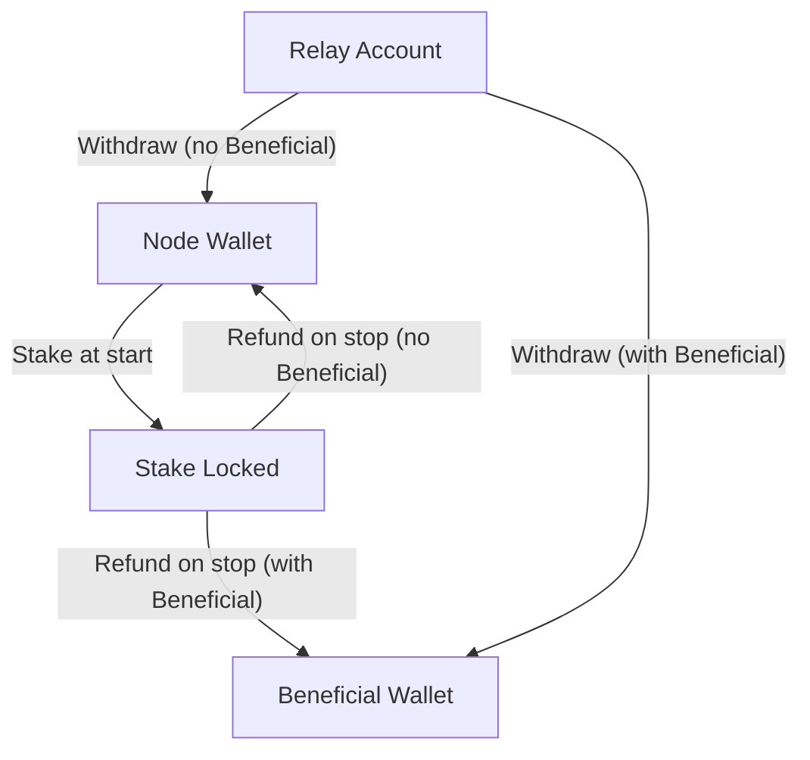

## Token Flow in the Crynux System

This page explains, in simple terms, where your tokens are, when they move, and where you can see them. There are four main places/accounts involved:

| Place | Description | Visible in on-chain wallet? | Where to view | Network check |
| --- | --- | --- | --- | --- |
| Node Wallet | Your on-chain node wallet (e.g., MetaMask). | Yes (except staked portion) | MetaMask (node address) | Check both L2 blockchains (switch networks) |
| Beneficial Wallet | On-chain beneficial wallet (if configured) that receives refunds and withdrawals. | Yes (when used) | MetaMask (beneficial address) | Check both L2 blockchains (switch networks) |
| Stake Locked | Tokens locked as stake after you start the node. | No | Node WebUI | Check both L2 blockchains (switch node versions) |
| Relay Account | Task fees credited while your node executes tasks. Stored in the Crynux Relay. | No | Crynux Portal and Node WebUI | - |

### Node Wallet

- When you start the node, the required stake is deducted from your On-chain Node Wallet.
- The deducted amount becomes Stake Locked. It will not show in MetaMask (or other wallets) because it is locked. You can see the locked amount in the Node WebUI (see Stake Locked below).
- When you stop the node and there is no Beneficial Address set, the stake refund goes back to the Node Wallet and will be visible there.
- When withdrawing task fees in the Portal and there is no Beneficial Address set, withdrawals go to the Node Wallet.


If you obtained test CNX via Discord, those are credits shown in the Node WebUI as CNX Balance and CNX Staked. They move between Balance and Staked when you start/stop the node and never appear in your on-chain wallet.


### Stake Locked

- What it is: the portion of tokens deducted from the Node Wallet at start and locked as stake by the node.
- Visibility: not visible in wallet balances or the Portal; visible in the Node WebUI as “CNX Staked”.
- Lifecycle: created when the node starts; released when the node stops.
  - If a Beneficial Address is configured, the released stake is refunded to the Beneficial Wallet.
  - Otherwise, the released stake is refunded to the Node Wallet.
- You cannot transfer Stake Locked directly; it becomes spendable only after it is refunded on stop.

### Beneficial Wallet

- If a Beneficial Address is configured for the Node Wallet, the stake refund after stopping the node is sent to the Beneficial Wallet. It will not appear in the Node Wallet; check the wallet that controls the Beneficial Address.
- If a Beneficial Address is configured, Portal withdrawals of task fees are sent to the Beneficial Wallet.
- Always verify balances using the wallet that holds the Beneficial Address.

### Relay Account

- Task fees earned by your node are credited to the Relay Account, which is recorded in the Crynux Relay.
- This balance is not reflected in the on-chain balance of your wallet. You can view it in the Crynux Portal and in the Node WebUI.
- How to view: import or select your Node Wallet address in MetaMask, open the Crynux Portal, connect with the Node Wallet, and check the Dashboard for the Relay Account balance and details. You can also check the Node WebUI.
- How to withdraw: in the Portal, use Withdraw to move funds from the Relay Account to an on-chain address.
  - If a Beneficial Address is configured, withdrawals go to the Beneficial Wallet.
  - Otherwise, withdrawals go to the Node Wallet.
