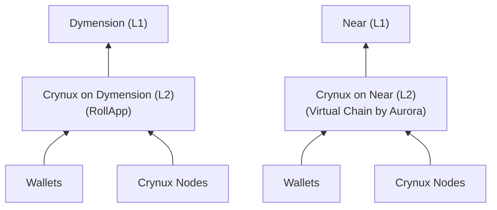

# Wallet Configuration

The Crynux Network is built on a multi-chain architecture, operating across multiple EVM-compatible blockchains. It currently supports Dymension and Near, with future plans to enable cross-chain token transfers.

On each supported chain, Crynux runs as its own Layer 2 blockchain. The Layer 2’s native gas token—such as ETH on the Dymension RollApp—serves as the Crynux Token (CNX) and behaves within the Crynux Network much like ETH on the Ethereum mainnet.

You can choose your preferred blockchain and connect using MetaMask or any other EVM-compatible wallets.

You can also use the Crynux Portal at [portal.crynux.io](https://portal.crynux.io) to add networks easily: open the site, connect your wallet, choose the network you want, and the portal will automatically add the corresponding network to MetaMask.

## Crynux Layer 2 Blockchains

### Crynux on Dymension

| Item           | Value                                  |
| -------------- | -------------------------------------- |
| JSON RPC       | https://json-rpc.testnet-dym.crynux.io |
| Chain ID       | 1313161573                             |
| Token Symbol   | CNX                                    |
| Decimal        | 18                                     |
| Block Explorer | -                                      |

### Crynux on Near

| Item           | Value                                   |
| -------------- | --------------------------------------- |
| JSON RPC       | https://json-rpc.testnet-near.crynux.io |
| Chain ID       | 1313161574                              |
| Token Symbol   | CNX                                     |
| Decimal        | 18                                      |
| Block Explorer | -                                       |
