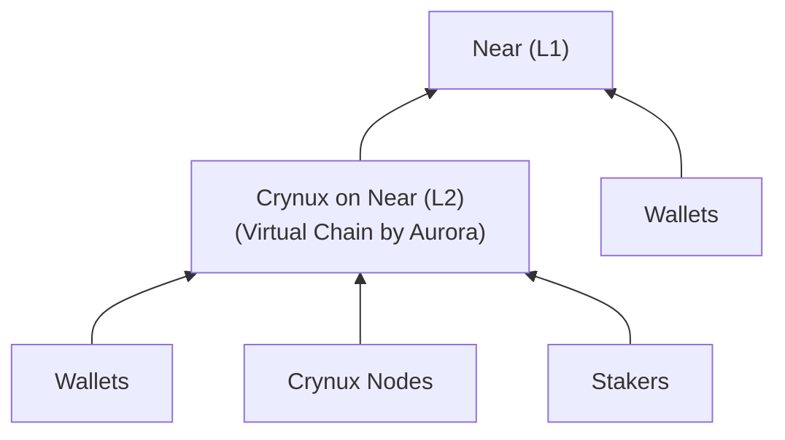
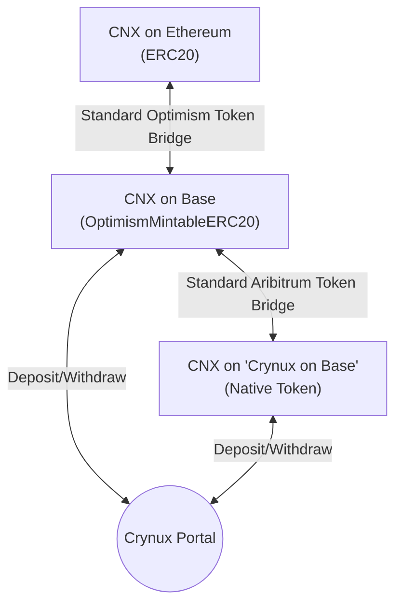

# Wallet Configuration

The Crynux Network is built on a multi-chain architecture, operating across multiple EVM-compatible blockchains. It currently supports Base and Near, with future plans to expand the ecosystem to more blockchains.

On each supported chain, Crynux runs as a dedicated Layer 2 blockchain. CNX is the native gas token on the Crynux Layer 2 network, similar to how ETH works on Ethereum mainnet. Each Crynux Layer 2 token is paired with a corresponding token on its Layer 1 network, such as the ERC20 Crynux token on Base. You can move tokens between Layer 1 and Layer 2 through bridges.

<pre class="language-mermaid"><code class="lang-mermaid"><strong>flowchart BT
</strong>  MM_BASE["Wallets"] --> BASE_CHAIN["Crynux on Base (L2)&#x3C;br/>(Arbitrum Orbit Chain)"]
  NODE_BASE["Crynux Nodes"] --> BASE_CHAIN
  BASE_CHAIN --> BASE["Base (L1)"]
  MM2_BASE["Wallets"] --> BASE
  STAKERS["Stakers"] --> BASE_CHAIN

</code></pre>


```mermaid
flowchart BT
  MM_NEAR["Wallets"] --> VC["Crynux on Near (L2)<br/>(Virtual Chain by Aurora)"]
  NODE_NEAR["Crynux Nodes"] --> VC
  VC --> NEAR["Near (L1)"]
  MM2_NEAR["Wallets"] --> NEAR
  STAKERS["Stakers"] --> VC
```

You can choose your preferred blockchain and connect using MetaMask or any other EVM-compatible wallets.

You can also use the Crynux Portal at [portal.crynux.io](https://portal.crynux.io) to add networks easily: open the site, connect your wallet, choose the network you want, and the portal will automatically add the corresponding network to MetaMask.

## Crynux Layer 2 Blockchains

### Crynux on Base

| Item           | Value                           |
| -------------- | ------------------------------- |
| JSON RPC       | https://json-rpc.base.crynux.io |
| Chain ID       | 18896214                        |
| Token Symbol   | CNX                             |
| Decimal        | 18                              |
| Block Explorer | -                               |

`Crynux on Base` uses CNX as its native token. All native CNX on `Crynux on Base` is bridged from the ERC20 Crynux Token on Base.

[Crynux Portal](https://portal.crynux.io) supports direct deposits from Base Network and withdrawals to Base Network. It can also be used to transfer CNX between Base and `Crynux on Base` without directly interacting with the native bridge contracts.

Base is an Ethereum Layer 2 chain using Optimism. The Crynux Token on Base is created through the standard Optimism bridge token factory on Base, and bridged from the ERC20 Crynux Token on Ethereum.


```mermaid
flowchart BT
  BASE_CNX["CNX on Base<br/>(OptimismMintableERC20)"] <-- Standard Optimism Token Bridge --> ETH_CNX["CNX on Ethereum<br/>(ERC20)"]
  
  CNX_PORTAL(("Crynux Portal")) <-- Deposit/Withdraw --> BASE_CNX
  CNX_ON_BASE["CNX on 'Crynux on Base'<br/>(Native Token)"] <-- Standard Aribitrum Token Bridge --> BASE_CNX
  CNX_PORTAL <-- Deposit/Withdraw --> CNX_ON_BASE
  
```


Crynux Portal does NOT support direct deposits and withdrawals to Ethereum Network. To move CNX between Base and Ethereum, use their standard ERC20 bridge contracts.


<table><thead><tr><th width="186">Network</th><th>Crynux Token CA</th></tr></thead><tbody><tr><td>Base</td><td><a href="https://basescan.org/token/0x9557DD9E241bc9636732623B672B4090AF519396">0x9557DD9E241bc9636732623B672B4090AF519396</a></td></tr><tr><td>Ethereum</td><td><a href="https://etherscan.io/token/0xa97998Bf97f5A6A96393b85B4e02A0440AE220F2">0xa97998Bf97f5A6A96393b85B4e02A0440AE220F2</a></td></tr></tbody></table>

### Crynux on Near


Coming soon. The Near network is still being deployed and will be available shortly.


## Crynux Relay

### Relay URL

`https://relay.crynux.io`

### Deposit Address


To prevent phishing, make sure to cross-check the deposit address in the [Crynux Discord](https://discord.gg/y8YKxb7uZk) and [Crynux Portal](https://portal.crynux.io/) before making the transfer.


```json
0x95dAd4af9aCaDEaf1704d3C980e7f571A9c5C5a0
```
