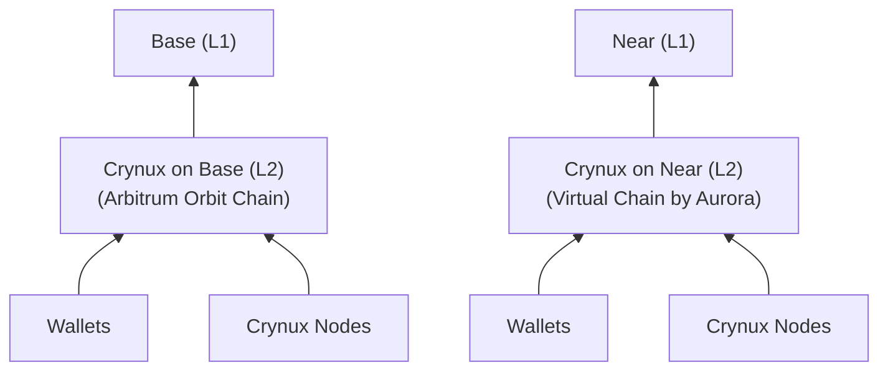

# Wallet Configuration

The Crynux Network is built on a multi-chain architecture, operating across multiple EVM-compatible blockchains. It currently supports Base and Near, with future plans to expand the ecosystem to more blockchains.

On each supported chain, Crynux runs as a dedicated Layer 2 blockchain. CNX is the native gas token on the Crynux Layer 2 network, similar to how ETH works on Ethereum mainnet. Each Crynux Layer 2 token is paired with a corresponding token on its Layer 1 network, such as the ERC20 Crynux token on Base. You can move tokens between Layer 1 and Layer 2 through bridges.


```mermaid
flowchart BT
  MM_BASE["Wallets"] --> BASE_CHAIN["Crynux on Base (L2)<br/>(Arbitrum Orbit Chain)"]
  NODE_BASE["Crynux Nodes"] --> BASE_CHAIN
  BASE_CHAIN --> BASE["Base (L1)"]

  MM_NEAR["Wallets"] --> VC["Crynux on Near (L2)<br/>(Virtual Chain by Aurora)"]
  NODE_NEAR["Crynux Nodes"] --> VC
  VC --> NEAR["Near (L1)"]

```

You can choose your preferred blockchain and connect using MetaMask or any other EVM-compatible wallets.

You can also use the Crynux Portal at [portal.crynux.io](https://portal.crynux.io) to add networks easily: open the site, connect your wallet, choose the network you want, and the portal will automatically add the corresponding network to MetaMask.

## Crynux Layer 2 Blockchains

### Crynux on Base

| Item           | Value                                  |
| -------------- | -------------------------------------- |
| JSON RPC       | https://json-rpc.base.crynux.io |
| Chain ID       | 18896214                             |
| Token Symbol   | CNX                                    |
| Decimal        | 18                                     |
| Block Explorer | -                                      |

### Crynux on Near

| Item           | Value                                   |
| -------------- | --------------------------------------- |
| JSON RPC       | https://json-rpc.near.crynux.io |
| Chain ID       | 1313161574                              |
| Token Symbol   | CNX                                     |
| Decimal        | 18                                      |
| Block Explorer | -                                       |

## Crynux Relay

### Relay URL

`https://relay.crynux.io`

### Deposit Address


To prevent phishing, make sure to cross-check the deposit address in the [Crynux Discord](https://discord.gg/y8YKxb7uZk) and [Crynux Portal](https://portal.crynux.io/) before making the transfer.


```json
0x2003D1F047C1948cfE12e449379e3ce487070765
```
