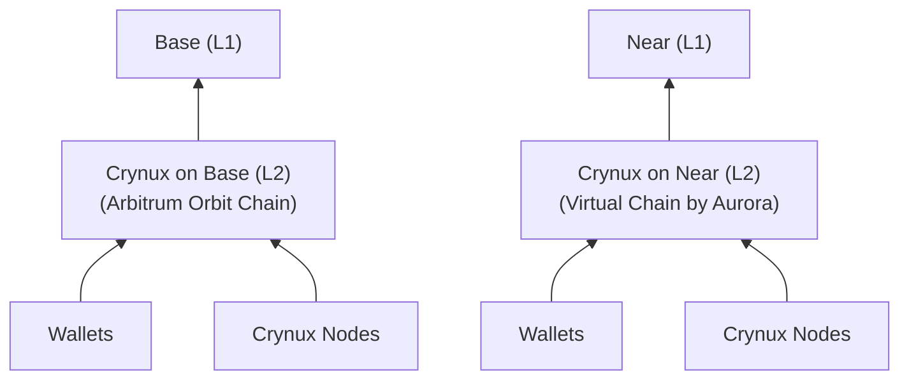

# Wallet Configuration

The Crynux Network is built on a multi-chain architecture, operating across multiple EVM-compatible blockchains. It currently supports Base and Near, with future plans to expand the ecosystem to more blockchains.

On each supported chain, Crynux runs as a dedicated Layer 2 blockchain. CNX is the native gas token on the Crynux Layer 2 network, similar to how ETH works on Ethereum mainnet. Each Crynux Layer 2 token is paired with a corresponding token on its Layer 1 network, such as the ERC20 Crynux token on Base. You can move tokens between Layer 1 and Layer 2 through bridges.


```mermaid
flowchart BT
  MM_BASE["Wallets"] --> BASE_CHAIN["Crynux on Base (L2)<br/>(Arbitrum Orbit Chain)"]
  NODE_BASE["Crynux Nodes"] --> BASE_CHAIN
  BASE_CHAIN --> BASE["Base (L1)"]

  MM_NEAR["Wallets"] --> VC["Crynux on Near (L2)<br/>(Virtual Chain by Aurora)"]
  NODE_NEAR["Crynux Nodes"] --> VC
  VC --> NEAR["Near (L1)"]

```

You can choose your preferred blockchain and connect using MetaMask or any other EVM-compatible wallets.

You can also use the Crynux Portal at [portal.crynux.io](https://portal.crynux.io) to add networks easily: open the site, connect your wallet, choose the network you want, and the portal will automatically add the corresponding network to MetaMask.

## Crynux Layer 2 Blockchains

### Crynux on Base

| Item           | Value                                  |
| -------------- | -------------------------------------- |
| JSON RPC       | https://json-rpc.base.crynux.io        |
| Chain ID       | 18896214                               |
| Token Symbol   | CNX                                    |
| Decimal        | 18                                     |
| Block Explorer | -                                      |

`Crynux on Base` uses CNX as its native token. All native CNX on `Crynux on Base` is bridged from the ERC20 Crynux Token on Base. The ERC20 Crynux Token address on Base is:

Crynux Token on Base: [0x0cba9e7585f91A758fa399B1A1dB148ADfE8cfd5](https://basescan.org/token/0x0cba9e7585f91A758fa399B1A1dB148ADfE8cfd5)

[Crynux Portal](https://portal.crynux.io) supports direct deposits from Base Network and withdrawals to Base Network. It can also be used to transfer CNX between Base and `Crynux on Base` without directly interacting with the native bridge contracts.

Base is an Ethereum Layer 2 chain. All ERC20 Crynux Tokens on Base are bridged from the ERC20 Crynux Token on Ethereum. The ERC20 Crynux Token address on Ethereum is:

Crynux Token on Ethereum: [0x19d8A7584830fbbB163E25e5691dc84c58467C2f](https://etherscan.io/token/0x19d8a7584830fbbb163e25e5691dc84c58467c2f)

Crynux Portal does not support direct deposits and withdrawals to Ethereum Network. To move CNX between Base and Ethereum, use their standard ERC20 bridge contracts.

### Crynux on Near

Coming soon. The Near network is still being deployed and will be available shortly.

## Crynux Relay

### Relay URL

`https://relay.crynux.io`

### Deposit Address


To prevent phishing, make sure to cross-check the deposit address in the [Crynux Discord](https://discord.gg/y8YKxb7uZk) and [Crynux Portal](https://portal.crynux.io/) before making the transfer.


```json
0x95dAd4af9aCaDEaf1704d3C980e7f571A9c5C5a0
```
