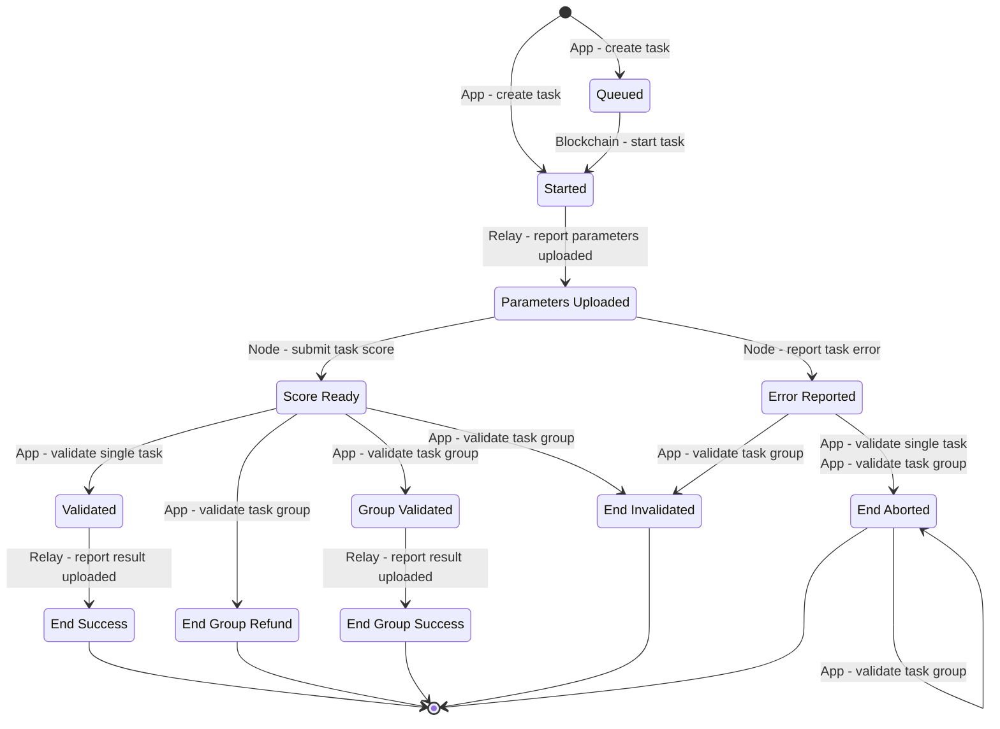

# Task State Transitions

## State Transition Graph

Relay owns task deadlines. A task can be aborted only by the deadline rule for its current state, or by its creator while it is still `Queued`. A selected node cannot abort a task.

The task state transition graph is given below. Deadline transitions to `EndAborted` are listed separately after the graph:

## Deadline Transitions

Only the row matching the current state applies. A state transition invalidates the preceding deadline.

| Current state | Deadline | Transition | Fee handling | Node handling |
| --- | --- | --- | --- | --- |
| `Queued` | Ordinary GPT and Stable Diffusion: `CreateTime + queue_timeout_seconds`. Stable Diffusion fine-tuning: `CreateTime + 3 minutes + Timeout`. | `Queued → EndAborted`, reason `TaskAbortTimeout` | Full refund | No selected node and no penalty |
| `Started` or `ParametersUploaded` | `StartTime + Timeout` | Current state `→ EndAborted`, reason `TaskAbortTimeout` | Full refund | Execution-timeout health penalty, then release |
| `ScoreReady` or `ErrorReported` | `ScoreReadyTime + app_validation_timeout_seconds` | Current state `→ EndAborted`, reason `TaskAbortCreatorValidationTimeout` | No refund; distribute this task's fee using the successful-task fee split | No penalty, then release |
| `Validated` or `GroupValidated` | `ValidatedTime + result_upload_timeout_seconds` | Current state `→ EndAborted`, reason `TaskAbortResultUploadTimeout` | Full refund | Result-upload-timeout health penalty, then release |

For ordinary GPT and Stable Diffusion tasks, Relay calculates execution `Timeout` after selecting the exact GPU variant. The execution parameters are estimates only; they do not determine validation, consensus, payment, or slashing.

`TaskAbortCreatorValidationTimeout` means the creator did not complete validation by the deadline. Its fee distribution compensates the node operator and eligible delegators for node time already occupied. The task remains `EndAborted`, and the distribution does not mean the result was correct. This applies to both `ScoreReady` and `ErrorReported`.

If any validation-group member reaches `EndAborted` for `TaskAbortCreatorValidationTimeout`, Relay permanently rejects validation of the whole group. The group cannot be validated by excluding that member. Other members retain their own deadlines and current states until they independently reach terminal states.

The creator can cancel only a task whose current state is `Queued`. This transition uses the creator-cancellation reason, gives a full refund, and does not penalize a node.

## Group Validation Results

When a task is validated in a validation group, its result state is determined according to the table below:

Rows containing `EndAborted` apply only when no member has ended with `TaskAbortCreatorValidationTimeout`. That reason permanently makes the group ineligible for validation.

<table data-full-width="true"><thead><tr><th width="191">Task 1 Before</th><th width="182">Task 2 Before</th><th width="165">Task 3 Before</th><th width="165">Task 1 After</th><th width="172">Task 2 After</th><th>Task 3 After</th></tr></thead><tbody><tr><td>ScoreReady (A)</td><td>ScoreReady (A)</td><td>ScoreReady (A)</td><td>GroupValidated</td><td>EndGroupRefund</td><td>EndGroupRefund</td></tr><tr><td>ScoreReady (A)</td><td>ScoreReady (A)</td><td>ScoreReady (B)</td><td>GroupValidated</td><td>EndGroupRefund</td><td>EndInvalidated</td></tr><tr><td>ScoreReady (A)</td><td>ScoreReady (B)</td><td>ScoreReady (C)</td><td>EndAborted</td><td>EndAborted</td><td>EndAborted</td></tr><tr><td>ScoreReady (A)</td><td>ScoreReady (A)</td><td>ErrorReported</td><td>GroupValidated</td><td>EndGroupRefund</td><td>EndInvalidated</td></tr><tr><td>ScoreReady (A)</td><td>ScoreReady (B)</td><td>ErrorReported</td><td>EndAborted</td><td>EndAborted</td><td>EndAborted</td></tr><tr><td>ScoreReady (A)</td><td>ScoreReady (A)</td><td>EndAborted</td><td>GroupValidated</td><td>EndGroupRefund</td><td>EndAborted</td></tr><tr><td>ScoreReady (A)</td><td>ScoreReady (B)</td><td>EndAborted</td><td>EndAborted</td><td>EndAborted</td><td>EndAborted</td></tr><tr><td>ScoreReady</td><td>ErrorReported</td><td>ErrorReported</td><td>EndInvalidated</td><td>EndAborted</td><td>EndAborted</td></tr><tr><td>ScoreReady</td><td>ErrorReported</td><td>EndAborted</td><td>EndAborted</td><td>EndAborted</td><td>EndAborted</td></tr><tr><td>ScoreReady</td><td>EndAborted</td><td>EndAborted</td><td>EndAborted</td><td>EndAborted</td><td>EndAborted</td></tr><tr><td>ErrorReported</td><td>ErrorReported</td><td>ErrorReported</td><td>EndAborted</td><td>EndAborted</td><td>EndAborted</td></tr><tr><td>ErrorReported</td><td>ErrorReported</td><td>EndAborted</td><td>EndAborted</td><td>EndAborted</td><td>EndAborted</td></tr><tr><td>ErrorReported</td><td>EndAborted</td><td>EndAborted</td><td>EndAborted</td><td>EndAborted</td><td>EndAborted</td></tr><tr><td>EndAborted</td><td>EndAborted</td><td>EndAborted</td><td>EndAborted</td><td>EndAborted</td><td>EndAborted</td></tr></tbody></table>

## Actions for Each State

<table><thead><tr><th width="248">State</th><th>Action</th></tr></thead><tbody><tr><td>Group Validated</td><td>Record the address of all the 3 nodes in the validation group.</td></tr><tr><td>End Success</td><td>Settle the payment. Release the node.</td></tr><tr><td>End Group Refund</td><td>Refund the payment. Release the node.</td></tr><tr><td>End Group Success</td><td>Distribute payment to 3 nodes. Release the node.</td></tr><tr><td>End Invalidated</td><td>Refund the payment. Slash the node.</td></tr><tr><td>End Aborted: CreatorValidationTimeout</td><td>Distribute this task's fee using the successful-task fee split as compensation for occupied node time. Do not mark the result correct. Do not penalize the node. Release the node.</td></tr><tr><td>End Aborted: all other reasons</td><td>Refund the payment. Apply a node health penalty only when the specific reason assigns the timeout to the node. Release a selected node.</td></tr></tbody></table>
